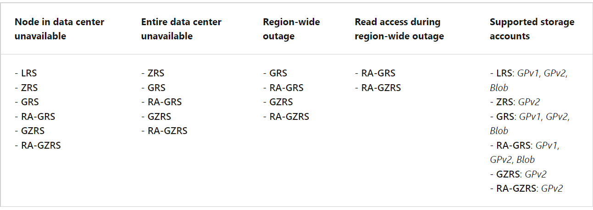

## AZ-104: Implement and manage storage in Azure

### 1. Configure Storage Account

### Implement Azure Storage

#### Advantages -

- Azure Storage is Microsoft's cloud storage solution for modern data storage scenarios.
- Azure Storage offers a massively scalable object store for data objects.
- It provides a file system service for the cloud, a messaging store for reliable messaging, and a NoSQL store.
- Azure Storage is a service that you can use to store files, messages, tables, and other types of information.
- Azure Storage for applications like file shares.
- Developers use Azure Storage for working data. Working data includes websites, mobile apps, and desktop applications.
- Azure Storage is also used by IaaS virtual machines, and PaaS cloud services.

#### Things to know about Azure Storage -

Azure Storage supports three categories of data: structured data, unstructured data, and virtual machine data.

- **Virtual machine data** 
  1. **Description** 
     - Virtual machine data storage includes disks and files.
     - Disks are persistent block storage for Azure IaaS virtual machines.
     - Files are fully managed file shares in the cloud.
  2. **Storage examples**
     - Storage for virtual machine data is provided through Azure managed disks.
     - Data disks are used by virtual machines to store data like database files, website static content, or custom application code.
     - Each data disk has a maximum capacity of 32,767 GB.

- **Unstructured data** 
  1. **Description** 
     - It can be a mix of information that's stored together, but the data doesn't have a clear relationship. 
     - The format of unstructured data is referred to as non-relational.
  2. **Storage examples**
     - Unstructured data can be stored by using Azure Blob Storage and Azure Data Lake Storage.
     - Blob Storage is a highly scalable, REST-based cloud object store.
     - Azure Data Lake Storage is the Hadoop Distributed File System (HDFS) as a service.

- **Structured data** 
  1. **Description** 
     - Structured data is stored in a relational format that has a shared schema. 
     - Structured data is often contained in a database table with rows, columns, and keys.
  2. **Storage examples**
     - Structured data can be stored by using Azure Table Storage, Azure Cosmos DB, and Azure SQL Database.
     - Azure Cosmos DB is a globally distributed database service. 
     - Azure SQL Database is a fully managed database-as-a-service built on SQL.

#### Storage account tiers -  

- **Standard tier**
  1. It is backed by magnetic hard disk drives (HDD).
  2. It provides the lowest cost per GB.
  3. You can use Standard tier storage for applications that require bulk storage or where data is infrequently accessed.
- **Premium tier**
  1. It is backed by solid-state drives (SSD).
  2. It offers consistent low-latency performance.
  3. You can use Premium tier storage for Azure virtual machine disks with I/O-intensive applications like databases.

>> Note : You can't convert a Standard tier storage account to a Premium tier storage account or vice versa. You must create a new storage account with the desired type and copy data, if applicable, to a new storage account.

#### Things to consider when using Azure Storage - 

- **Consider durability and availability**
  1. Azure Storage is durable and highly available.
  2. Redundancy ensures that your data is safe during hardware failure.
  3. You replicate data across datacenters or geographical regions for protection from local catastrophe or natural disaster.
  4. Data that's replicated remains highly available during an unexpected outage.
- **Consider secure access**
  1. All data written to Azure Storage is encrypted by the service.
  2. Azure Storage provides you with fine-grained control over who has access to your data.
- **Consider scalability**
  1. Azure Storage is designed to be massively scalable to meet the data storage and performance needs of modern applications.
- **Consider manageability**
  1. Microsoft Azure handles hardware maintenance, updates, and critical issues for you.
- **Consider data accessibility**
  1.  Data in Azure Storage is accessible from anywhere in the world over HTTP or HTTPS.
  2.  Microsoft provides SDKs for Azure Storage in various languages. You can use .NET, Java, Node.js, Python, PHP, Ruby, Go, and the REST API.
  3.  Azure Storage supports scripting in Azure PowerShell or the Azure CLI.
  4.  The Azure portal and Azure Storage Explorer offer easy visual solutions for working with your data.

### Explore Azure Storage services

- **Azure Blob Storage (containers):** A massively scalable object store for text and binary data.
- **Azure Files:** Managed file shares for cloud or on-premises deployments.
- **Azure Queue Storage:** A messaging store for reliable messaging between application components.
- **Azure Table Storage:** A NoSQL store for schemaless storage of structured data or relational data.

#### Azure Blob Storage (containers)
- It is microsoft's object storage solution for the cloud.
- Blob Storage is optimized for storing massive amounts of unstructured or non-relational data, such as text or binary data.
- It is ideal for serving images or documents directly to a browser.
- Storing files for distributed access.
- Streaming video and audio.
- Storing data for backup and restore, disaster recovery, and archiving.
- Storing data for analysis by an on-premises or Azure-hosted service.
- Objects in Blob Storage can be accessed from anywhere in the world via HTTP or HTTPS. 
- Users or client applications can access blobs via URLs, the Azure Storage REST API, Azure PowerShell, the Azure CLI, or an Azure Storage client library.
- The storage client libraries are available for multiple languages, including .NET, Java, Node.js, Python, PHP, and Ruby.
- You can access data from Azure Blob Storage by using the NFS protocol.

#### Azure Files
- Azure Files enables you to set up highly available network file shares.
- Shares can be accessed by using the Server Message Block (SMB) protocol and the Network File System (NFS) protocol.
- Multiple virtual machines can share the same files with both read and write access.
- You can also read the files by using the REST interface or the storage client libraries.
- Many on-premises applications use file shares.It makes it easier to migrate those applications that share data to Azure.If you mount the file share to the same drive letter that the on-premises application uses, the part of your application that accesses the file share should work with minimal, if any, changes.
- Configuration files can be stored on a file share and accessed from multiple virtual machines.Tools and utilities used by multiple developers in a group can be stored on a file share, ensuring that everybody can find them, and that they use the same version.
- Diagnostic logs, metrics, and crash dumps are just three examples of data that can be written to a file share and processed or analyzed later.
- The storage account credentials are used to provide authentication for access to the file share. 
- All users who have the share mounted should have full read/write access to the share.

#### Azure Queue Storage
- Azure Queue Storage is used to store and retrieve messages.
- Queue messages can be up to 64 KB in size, and a queue can contain millions of messages.
- Queues are used to store lists of messages to be processed asynchronously.

#### Azure Table Storage (Azure Cosmos DB)
- It is a fully managed NoSQL database service for modern app development.
- As a fully managed service, Azure Cosmos DB takes database administration off your hands with automatic management, updates, and patching.
- It also handles capacity management with cost-effective serverless and automatic scaling options that respond to application needs to match capacity with demand.
- Azure Cosmos DB Table API offers that provides throughput-optimized tables, global distribution, and automatic secondary indexes.
- Table Storage is ideal solution for storing structured or relational data.

#### Things to consider when choosing Azure Storage services
- **Consider storage optimization for massive data** 
  1. Azure Blob Storage is optimized for storing massive amounts of unstructured data.
  2. Objects in Blob Storage can be accessed from anywhere in the world via HTTP or HTTPS. 
  3. Blob Storage is ideal for serving data directly to a browser, streaming data, and storing data for backup and restore.
- **Consider storage with high availability** 
  1. Azure Files supports highly available network file shares.
  2. On-premises apps use file shares for easy migration.
  3. By using Azure Files, all users can access shared data and tools.
  4. Storage account credentials provide file share authentication to ensure all users who have the file share mounted have the correct read/write access.
- **Consider storage for messages**
  1. Use Azure Queue Storage to store large numbers of messages.
  2. Queue Storage is commonly used to create a backlog of work to process asynchronously.
- **Consider storage for structured data**
  1. Azure Table Storage is ideal for storing structured, relational data. 
  2. It provides throughput-optimized tables, global distribution, and automatic secondary indexes. 
  3. Because Azure Table Storage is part of Azure Cosmos DB, you have access to a fully managed NoSQL database service for modern app development.

### Determine storage account types

#### Things to know about storage account types
- **Standard general-purpose v2**
  - **Supported services ->** Blob Storage (including Data Lake Storage), Queue Storage, Table Storage, and Azure Files
  - **Recommended usage ->** Standard storage account for most scenarios, including blobs, file shares, queues, tables, and disks (page blobs).
- **Premium block blobs**
  - **Supported services ->** Blob Storage (including Data Lake Storage)
  - **Recommended usage ->** Premium storage account for block blobs and append blobs. Recommended for applications with high transaction rates. Use Premium block blobs if you work with smaller objects or require consistently low storage latency. This storage is designed to scale with your applications.
- **Premium file shares**
  - **Supported services ->** Azure Files
  - **Recommended usage ->** Premium storage account for file shares only. Recommended for enterprise or high-performance scale applications. Use Premium file shares if you require support for both Server Message Block (SMB) and NFS file shares.
- **Premium page blobs**
  - **Supported services ->** Page blobs only
  - **Recommended usage ->** Premium high-performance storage account for page blobs only. Page blobs are ideal for storing index-based and sparse data structures, such as operating systems, data disks for virtual machines, and databases.

>> Note : All storage account types are encrypted by using Storage Service Encryption (SSE) for data at rest.

### Determine replication strategies

#### Advantages
- The data in your Azure storage account is always replicated to ensure durability and high availability.
- Azure Storage replication copies your data so that it's protected from planned and unplanned events.
- These events range from transient hardware failures, network or power outages, massive natural disasters, and so on
- You can choose to replicate your data within the same data center, across zonal data centers within the same region, and even across regions.
- Replication ensures your storage account meets the Service-Level Agreement (SLA) for Azure Storage even if there are failures.

There are four replication strategies:

1. **Locally redundant storage**
   - Locally redundant storage is the lowest-cost replication option and offers the least durability compared to other strategies.
   - If a data center-level disaster occurs, such as fire or flooding, all replicas might be lost or unrecoverable.
   - Your application stores data that can be easily reconstructed if data loss occurs.
   - Your data is constantly changing like in a live feed, and storing the data isn't essential.
   - Your application is restricted to replicating data only within a country due to data governance requirements.
2. **Zone redundant storage**
   - Zone redundant storage synchronously replicates your data across three storage clusters in a single region.
   - Each storage cluster is physically separated from the others and resides in its own availability zone.
   - Each availability zone, and the ZRS cluster within it, is autonomous, and has separate utilities and networking capabilities.
   - Storing your data in a ZRS account ensures you can access and manage your data if a zone becomes unavailable.
   - ZRS provides excellent performance and low latency.
   - ZRS isn't currently available in all regions.
   - Changing to ZRS from another data replication option requires the physical data movement from a single storage stamp to multiple stamps within a region.
3. **Geo-redundant storage**
   - Geo-redundant storage replicates your data to a secondary region.
   - GRS provides a higher level of durability even during a regional outage.
   - When your storage account has GRS enabled, your data is durable even when there's a complete regional outage or a disaster where the primary region isn't recoverable.
   - With GRS The data is available to be read only if Microsoft initiates a failover from the primary to secondary region.
   - Read-access geo-redundant storage (RA-GRS) is based on GRS.
   - RA-GRS replicates your data to another data center in a secondary region, and also provides you with the option to read from the secondary region.
   - With RA-GRS, you can read from the secondary region regardless of whether Microsoft initiates a failover from the primary to the secondary.
   - For a storage account with GRS or RA-GRS enabled, all data is first replicated with locally redundant storage.
4. **Geo-zone redundant storage**
   - Geo-zone-redundant storage combines the high availability of zone-redundant storage with protection from regional outages as provided by geo-redundant storage.
   - Data in a GZRS storage account is replicated across three Azure availability zones in the primary region, and also replicated to a secondary geographic region for protection from regional disasters.
   - Each Azure region is paired with another region within the same geography, together making a regional pair.
   - With a GZRS storage account, you can continue to read and write data if an availability zone becomes unavailable or is unrecoverable.
   - Data is also durable during a complete regional outage or during a disaster in which the primary region isn't recoverable. 
   -  You can optionally enable read access to data in the secondary region with read-access geo-zone-redundant storage (RA-GZRS).

#### Things to consider when choosing replication strategies

### Access storage
- Every object you store in Azure Storage has a unique URL address.
- The combination of the subdomain and the domain name, which is specific to each service, forms an endpoint for your storage account.
- Container service -> //mystorageaccount.blob.core.windows.net
- Table service -> //mystorageaccount.table.core.windows.net
- Queue service -> //mystorageaccount.queue.core.windows.net
- File service -> //mystorageaccount.file.core.windows.net
- We create the URL to access an object in your storage account by appending the object's location in the storage account to the endpoint.
  /mystorageaccount.blob.core.windows.net/mycontainer/myblob
  
#### Configure custom domains
There are two ways to configure a custom domain: direct mapping and intermediary domain mapping.
**Direct mapping** lets you enable a custom domain for a subdomain to an Azure storage account. 
The following example shows how a subdomain is mapped to an Azure storage account to create a CNAME record in the domain name system (DNS):
- Subdomain: blobs.contoso.com
- Azure storage account: \<storage account>\.blob.core.windows.net
- Direct CNAME record: contosoblobs.blob.core.windows.net
**Intermediary domain mapping** is applied to a domain that's already in use within Azure.This approach might result in minor downtime while the domain is being mapped. To avoid downtime, you can use the "asverify" intermediary domain to validate the domain.
The following example shows how a domain in use is mapped to an Azure storage account in the DNS with the asverify intermediary domain:
- CNAME record: asverify.blobs.contoso.com
- Intermediate CNAME record: asverify.contosoblobs.blob.core.windows.

>> Note : Azure Storage doesn't currently provide native support for HTTPS with custom domains. You can implement an Azure Content Delivery Network (CDN) to access blobs by using custom domains over HTTPS.

#### Secure storage endpoints
- Each Azure service has required steps to configure the service endpoints and restrict network access for the service.
- To access these settings for your storage account, you use the Firewalls and virtual networks settings. 
- You add the virtual networks that should have access to the service for the account.

### Things to know about configuring service endpoints
- The Firewalls and virtual networks settings restrict access to your storage account from specific subnets on virtual networks or public IPs.
- You can configure the service to allow access to one or more public IP ranges.
- Subnets and virtual networks must exist in the same Azure region or region pair as your storage account.

### 2. Configure Azure Blob Storage

### Implement Azure Blob Storage

#### Things to know about Azure Blob Storage
Blob Storage uses three resources to store and manage your data:
- An Azure storage account
- Containers in an Azure storage account
- Blobs in a container

To implement Blob Storage, you configure several settings:
- Blob container options
- Blob types and upload options
- Blob Storage access tiers
- Blob lifecycle rules
- Blob object replication options

#### Things to consider when implementing Azure Blob Storage
- **Consider browser uploads** -> Use Blob Storage to serve images or documents directly to a browser.
- **Consider distributed access** -> Blob Storage can store files for distributed access, such as during an installation process.
- **Consider streaming data** -> Stream video and audio by using Blob Storage.
- **Consider archiving and recovery** -> Blob Storage is a great solution for storing data for backup and restore, disaster recovery, and archiving.
- **Consider application access** -> You can store data in Blob Storage for analysis by an on-premises or Azure-hosted service.

### Create blob containers

#### Things to know about containers and blobs
- All blobs must be in a container.
- A container can store an unlimited number of blobs.
- An Azure storage account can contain an unlimited number of containers.
- You can create the container in the Azure portal.
- You upload blobs into a container.

#### Configure a container
- In the Azure portal, you configure two settings to create a container for an Azure storage account.
- **Name:** Enter a name for your container. The name must be unique within the Azure storage account.
- **Public access level:** The access level specifies whether the container and its blobs can be accessed publicly. By default, container data is private and visible only to the account owner. There are three access level choices:
  1. **Private:** (Default) Prohibit anonymous access to the container and blobs.
  2. **Blob:** Allow anonymous public read access for the blobs only.
  3. **Container:** Allow anonymous public read and list access to the entire container, including the blobs

#### Assign blob access tiers
- **Hot Tiers** -> The Hot tier is optimized for frequent reads and writes of objects in the Azure storage account.By default, new storage accounts are created in the Hot tier.
- **Cool Tiers** -> The Cool tier is optimized for storing large amounts of data that's infrequently accessed.This tier is intended for data that remains in the Cool tier for at least 30 days.A usage case for the Cool tier is short-term backup and disaster recovery datasets and older media content.
- **Archive Tiers** -> The Archive tier is an offline tier that's optimized for data that can tolerate several hours of retrieval latency. Data must remain in the Archive tier for at least 180 days or be subject to an early deletion charge. Data for the Archive tier includes secondary backups, original raw data, and legally required compliance information.
- **Premium Blob Storage** -> Premium Blob Storage is best suited for I/O intensive workloads that require low and consistent storage latency. Premium Blob Storage uses solid-state drives (SSDs) for fast and consistent response times. This storage is best for workloads that perform many small transactions.

#### Compare access tiers
